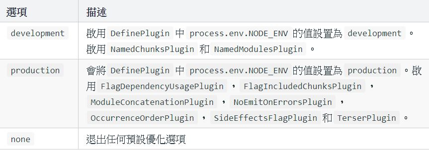

# mode

mode是webpack4新增的一條屬性，它的意思為當前開發的環境。mode的到來減少了很多的配置，它內置了很多的功能。相較以前的版本提升了很多，減少了很多專門的配置

- 提升了構建速度
- 默認為開發環境，不需要專門配置
- 提供壓縮功能，不需要藉助插件
- 提供SouceMap，不需要專門配置

mode分為兩種環境，一種是開發環境（development）,一種是生產環境（production）。開發環境就是我們寫代碼的環境，生產環境就是代碼放到線上的環境。這兩種環境的最直觀區別就是，開發環境的代碼不提供壓縮，生產環境的代碼提供壓縮。
