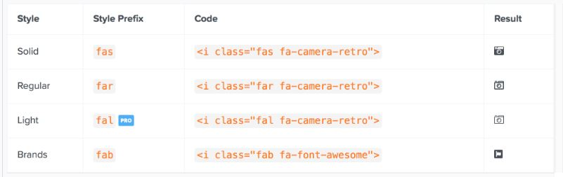

# 功能

## 圖示類別

過去只有 `fa` 而在 FontAwesome 5 因為將圖示分成了 4 大類，所以在使用時前綴變成了 `fas`, `far`, `fal` 和 `fab` ，分別代表 `Solid`, `Regular`,`Light` 和 Brands&lt;c/ode&gt;：



## 基本操作

如果只是要調整基本的樣式，可以在圖示外面的 `<div>` 給一個樣式，圖示會自動繼承父層的樣式

```javascript
<div style="font-size:3em; color:Tomato">
  <i class="fas fa-camera-retro"></i>
</div>
```

和過去一樣在 FontAwesome 5 中寫好了許多不同的 class 名稱可以讓你直接套用，像是尺寸：

```javascript
<!-- 尺寸：.fa-xs, .fa-sm, .fa-lg, .fa-2x ~ .fa-10x -->
<i class="fa fa-camera-retro fa-xs"></i>
```

特定的圖示可以搭配旋轉動畫 .fa-spin

```javascript
<!-- 旋轉動畫： .fa-spin -->
<div class="fa-3x">
  <i class="fas fa-spinner fa-spin"></i>
</div>
```

另外還多了固定寬度 `.fa-fw`，取代項目清單 `.fa-ul`, `.fa-li`，邊框 `.fa-border`，推移 `.fa-pull-right`, `.fa-pull-left`

## 新增功能

由於 FontAwesome 5 是使用 SVG 搭配 JS，使得這些圖示可以做很多不同的變換，像是：

1、透過 data-fa-transform 可以使用縮放、位置、旋轉和翻轉：


```javascript
<!--
  - 縮放： grow-# 或 shrink-#
 -->
<i class="fas fa-magic" data-fa-transform="shrink-8" style="background:MistyRose"></i>
<i class="fas fa-magic" data-fa-transform="grow-6" style="background:MistyRose"></i>
```

2、透過 data-fa-mask 可以讓兩個圖示疊合在一起製作遮罩的效果：


```javascript
<!--
  - 遮罩： data-fa-mask
 -->
<i class="fab fa-facebook-f" data-fa-mask="fas fa-circle" style="background:MistyRose"></i>
```

3、透過 fa-layers 可以同時疊合兩個以上的圖示和文字，這是我覺得在 FontAwesome 5 中非常實用的效果，可以做出像是圖層的樣式：


```javascript
<!--
  - 圖層：fa-layers
  - 文字：fa-layers-text
  - 計數：fa-layers-counter
 -->

  <span class="fa-layers fa-fw" style="background:MistyRose">
    <i class="fas fa-calendar"></i>
    <span class="fa-layers-text fa-inverse" data-fa-transform="shrink-8 down-3" style="font-weight:900">27</span>
  </span>
```

