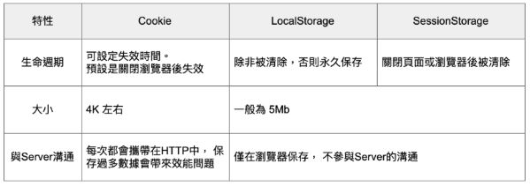

# storage

* 都是使用 key / value pair 的方式 給值或取值
* 大小預設有 5mb
* 每次 request 不會帶上

## localStorage

⇒ 不會過期，除非手動清除

* 讀取  

  ```javascript
  localStorage.getItem('key’);
  ```

* 更新

  ```javascript
  localStorage.setItem(‘key’,data);
  ```

* 刪除

  ```javascript
  localStorage.removeItem('key’,data);
  ```

  **sessionStorage**

  ⇒ 每次分頁或瀏覽器關掉後就會清除

* 讀取

  ```javascript
  sessionStorage.getItem('key’);
  ```

* 更新  

  ```javascript
  sessionStorage.setItem('key’,data);
  ```

* 刪除  

  ```javascript
  sessionStorage.removeItem('key’,data);
  ```

## 比較



