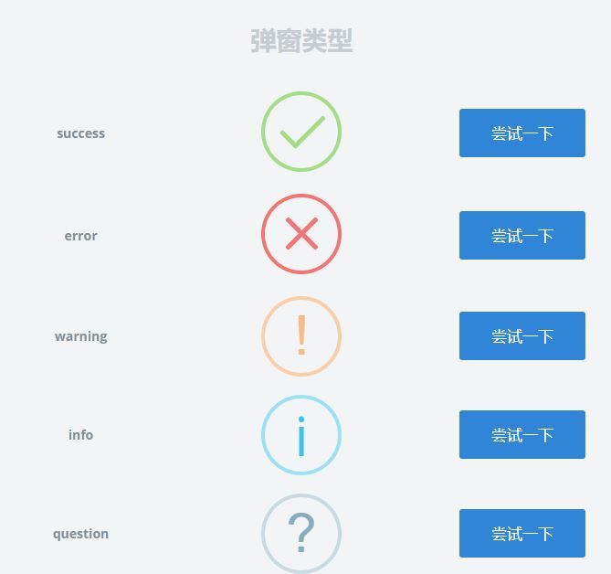
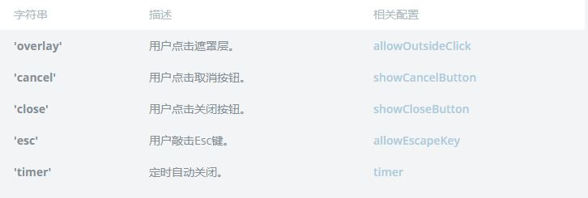

# 使用

### 用法
***
```js
swal({
  title: '<span class="title">Title</span>',
  html: '<span class="text">HTML description</span>'
});
```
#### 配置
可以使用配置参數，通過一個對象傳入到sweetAlert2中

#### 圖示type名稱



#### 處理關閉
當用戶将彈窗關閉時，swal()返回的Promise將使用帶有字符串参数的reject來記錄談窗被退出的原因:

如果未處理失敗，則將會記錄為错誤。為了避免這種情况，請在Promise中添加失敗處理。
或者你可以使用.catch(swal.noop)作為簡單阻止错誤的快速方法：
```js
swal(...)
  .catch(swal.noop)
```
### 實作 -- nuxt
***
```
<template>
    <div>
        <button @click="kick">message</button>
    </div>
</template>

<script>
import swal from 'sweetalert2'

export default {
    methods:{
        kick(){
        swal.fire({
            title: '自动关闭弹窗！',
            text: '2秒后自动关闭。',
            timer: 2000
        }).then(
            function () {},
            // handling the promise rejection
            function (dismiss) {
                if (dismiss === 'timer') {
                    console.log('I was closed by the timer')
                }
            }
        )
        }
    }
}
```
#### 報錯 ->typeerror: Cannot read property 'constructor' of undefined
```js
swal.fire({  //加入.fire
  title: '<span class="title">Title</span>',
  html: '<span class="text">HTML description</span>'
});
```


