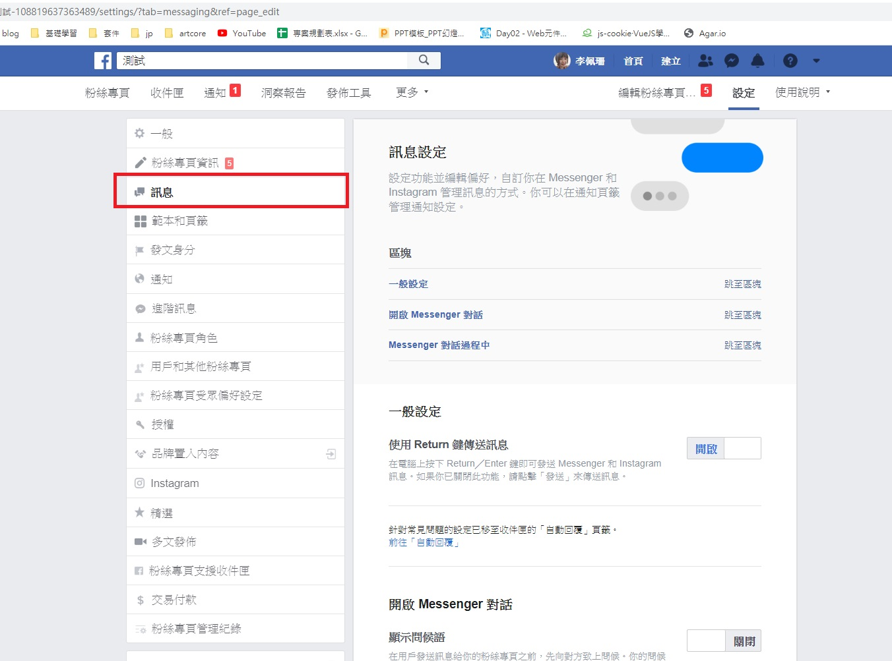
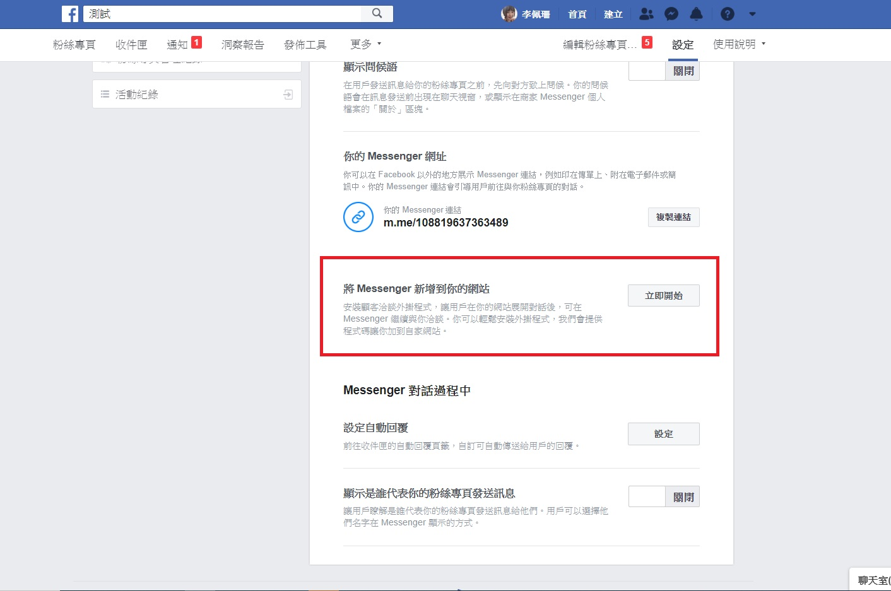
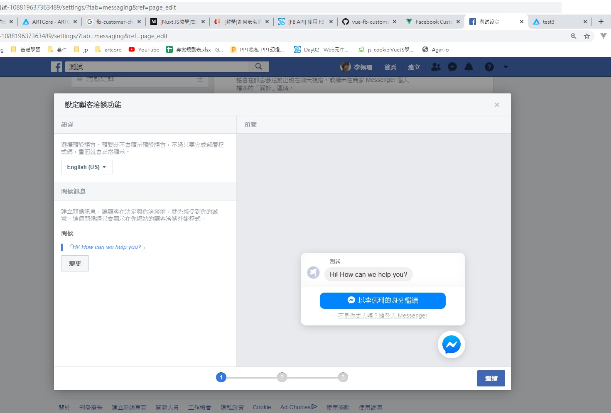
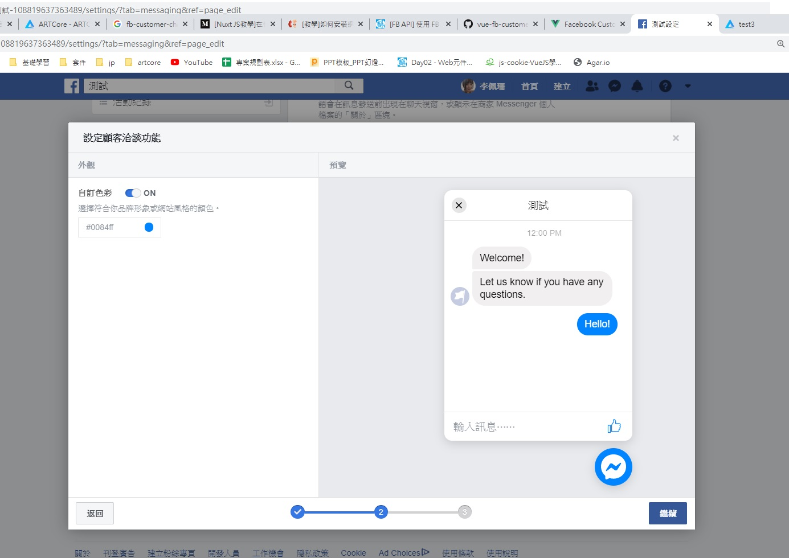
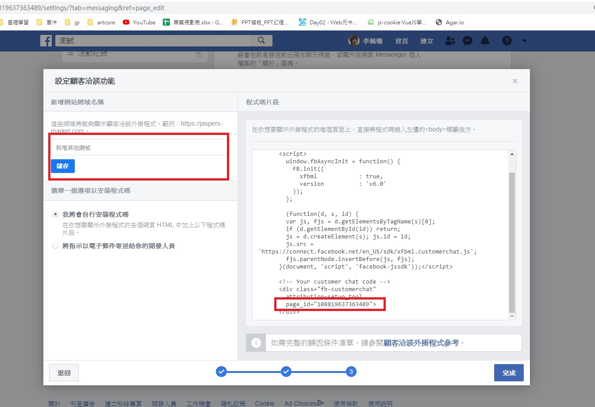

# vue-fb-customer-chat

Vue.js的Facebook客戶聊天插件

## 安裝
```js
npm install vue-fb-customer-chat // npm 
yarn add vue-fb-customer-chat // yarm
```

## 使用

### vue中使用

```js
import Vue from 'vue'
import VueFbCustomerChat from 'vue-fb-customer-chat'
 
Vue.use(VueFbCustomerChat, {
  page_id: null, //  change 'null' to your Facebook Page ID,
  theme_color: '#333333', // theme color in HEX
  locale: 'en_US', // default 'en_US'
})
```

### nuxt中使用

創建'plugins / vue-fb-customer-chat.js'

```js
import Vue from 'vue'
import VueFbCustomerChat from 'vue-fb-customer-chat'
 
Vue.use(VueFbCustomerChat, {
  page_id: "xxxxxxxxxxxxxxx", // 輸入 Facebook Page ID,
  theme_color: '#6699cc', // 設定messenger顏色
  locale: 'zh_TW', // 設定語言
  logged_out_greeting:"嗨~有問題可以私訊我喔！", //登入狀態歡迎詞
  logged_in_greeting:"您好，很高興為您服務" //登出(未登入)狀態歡迎詞
})
```

在nuxt.conf.js文件中為插件部分添加插件

```js
plugins: [
  { src: '~/plugins/vue-fb-customer-chat.js', ssr: false }
],
```

之後在你想呈現的頁面中加入
```js
<div id=”fb-root”> </div>
```

### FB設置、取得ID

到粉絲專頁頁面點選設定

接著在左側菜單點選訊息



點選立即開始



此處可設定語言



自訂外觀顏色



左側新增其他網域是負責讓Facebook messenger知道你的網址(部落格)
並且只接受正式網域，所以如果是在localhost測試是沒有效果的



## 參考文獻

https://github.com/dmnWebDesign/vue-fb-customer-chat 官方github

https://medium.com/@zx2515296964/nuxtjs%E6%95%99%E5%AD%B8-%E5%9C%A8%E4%BD%A0%E7%B6%B2%E7%AB%99%E6%9E%B6%E8%A8%AD%E5%B1%AC%E6%96%BC%E4%BD%A0%E7%9A%84%E8%81%8A%E5%A4%A9%E6%A9%9F%E5%99%A8%E4%BA%BA-facebook-customer-chat%E4%B8%B2%E6%8E%A5%E6%95%99%E5%AD%B8-8c060ec95c1f