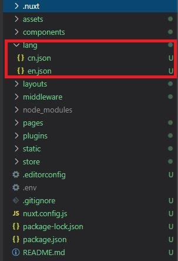

# 實作 -- nuxt
### 在nuxt應用程式中引入vue-i18n
新建檔案  ~plugins/i18n.js

```js
import Vue from 'vue'
import VueI18n from 'vue-i18n'
import Cookies from 'js-cookie'

Vue.use(VueI18n)
Vue.use(Cookies)

export default ({ app, store }) => {
    // Set i18n instance on app
    // This way we can use it in middleware and pages asyncData/fetch
    app.i18n = new VueI18n({
        locale: Cookies.get('locale'),
        fallbackLocale: 'en',
        messages: {
            en: require('~/lang/en.json'),
            cn: require('~/lang/cn.json')
        }
    })

    app.i18n.path = (link) => {
        if (app.i18n.locale === app.i18n.fallbackLocale) {
            return `/${link}`
        }

        return `/${app.i18n.locale}/${link}`
    }
}
```

### 建立一個（middleware）中間件，用來管理不同的語言
在middleware下新建i18n.js用來控制語言切換  ~middleware/i18n.js

```js
export default function({ isHMR, app, store, route, params, error, redirect }) {
    const defaultLocale = app.i18n.fallbackLocale
        // If middleware is called from hot module replacement, ignore it
    if (isHMR) { return }
    // Get locale from params
    const locale = params.lang || defaultLocale
    if (!store.state.locales.includes(locale)) {
        return error({ message: 'This page could not be found.', statusCode: 404 })
    }
    // Set locale
    store.commit('SET_LANG', locale)
    app.i18n.locale = store.state.locale
        // If route is /<defaultLocale>/... -> redirect to /...
    if (locale === defaultLocale && route.fullPath.indexOf('/' + defaultLocale) === 0) {
        const toReplace = '^/' + defaultLocale + (route.fullPath.indexOf('/' + defaultLocale + '/') === 0 ? '/' : '')
        const re = new RegExp(toReplace)
        return redirect(
            route.fullPath.replace(re, '/')
        )
    }
}
```

### 修改nuxt.config.js檔案配置

```js
 router: {
        middleware: 'i18n'
    },

    plugins: ['@/plugins/i18n.js',
    ],

    generate: {
        routes: ['/', '/about', '/cn', '/cn/about']
    },
```

### 建立本地語言包
1、在跟目錄下建立 lang 資料夾



2、建立語言包 
 EX: （~lang/en.js）
 ```js
 {
  "links": {
    "home": "Home",
    ...
  },
  "home": {
    "title": "Welcome",
    "introduction": "This is an introduction in English."
  },
  "about": {
    "title": "About",
    "introduction": "..."
  }
}
```

### 建立頁面，進行翻譯
~pages/index.vue

```js
<template>
<div>
  <p>{{ $t('home') }}</p>
  <button @click="changeLanguage('cn')" >cn</button>
  <button @click="changeLanguage('en')" >en</button><br>
  
</div>
</template>

<script>
export default {
  data(){
    return{
      time:''
    }
  },
    methods: {
      changeLanguage (language) {
        this.$store.commit('SET_LANG', language)
        location.reload()
      },
      
    },
    
}

</script>
```