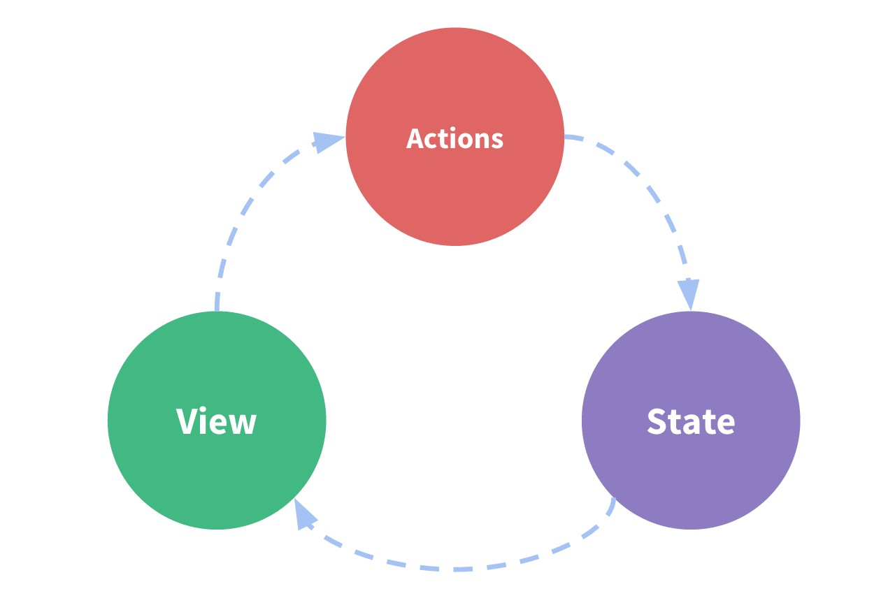
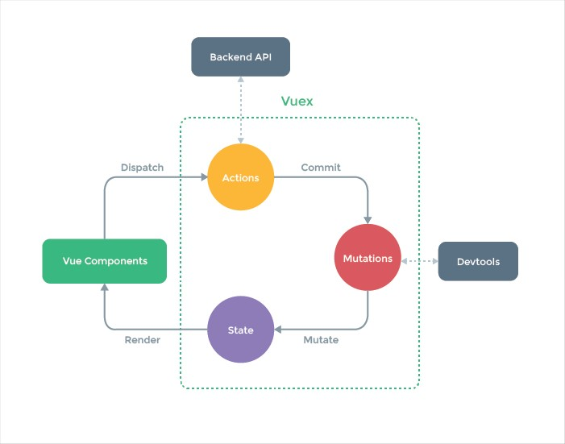

# vuex

## Vuex是什麼？
Vuex是一個專為Vue.js應用程序開發的狀態管理模式。它採用集中式存儲管理應用的所有組件的狀態，並以相應的規則保證狀態以一種可預測的方式發生變化。Vuex也集成到Vue的官方調試工具devtools extension，提供了諸如零配置的time-travel調試、狀態快照導入導出等高級調試功能。

- 單向資料流
- Flux design pettern
- 統一管理應用程式所有狀態
- 官方推薦項目之一

所有的動作都是從 action 出發，接著到了 store 把結果存起來改變 state 然後因為 state 改變了，所以 view（元件或頁面）就會跟著改變。

只有一個重點，就是這一連串的行為是不可逆的，因此稱為：<mark>單向資料流</mark>。

- Vuex 最主要包含了 Actions, Mutations, State 的存取和操作
- 使用 Commit 呼叫 Mutations，Dispatch 呼叫 Actions，只能透過 Mutations 來更新 State
- 只能用 Actions 來呼叫外部資源、API，執行完如需更新 State 仍需要透過 Mutations 來做

## 什麼情況下我應該使用Vuex？
Vuex 可以幫助我們管理共享狀態，並附帶了更多的概念和框架。這需要對短期和長期效益進行權衡。
如果您不打算開發大型單頁應用，使用Vuex可能是繁瑣冗餘的。確實是如此——如果您的應用夠簡單，您最好不要使用Vuex。一個簡單的store模式就足夠您所需了。但是，如果您需要構建一個中大型單頁應用，您很可能會考慮如何更好地在組件外部管理狀態，Vuex將會成為自然而然的選擇。

## 參考文獻

https://ithelp.ithome.com.tw/articles/10185686

https://vuex.vuejs.org/zh/

https://jeremysu0131.github.io/categories/vuejs/page/2/